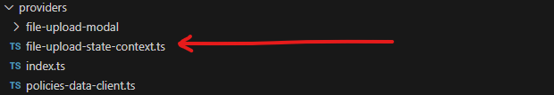
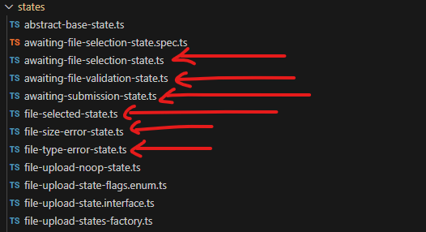
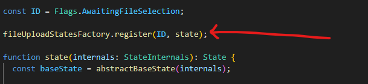
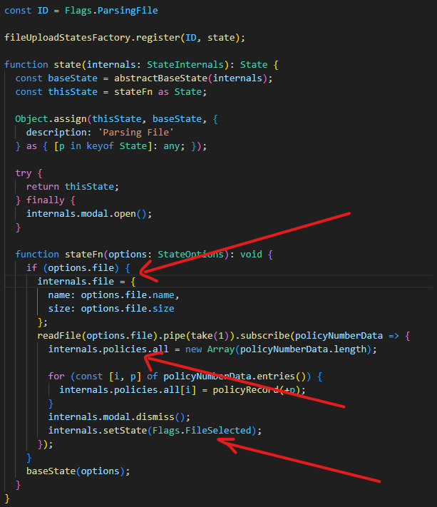
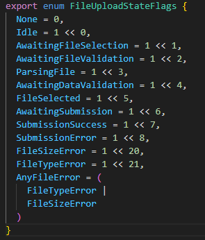
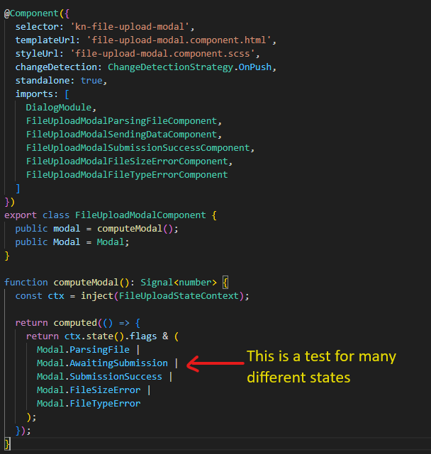
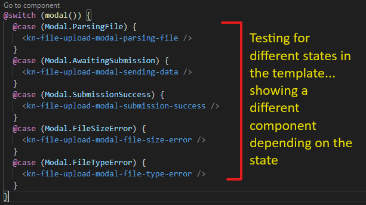

# File Upload States
The functions and interfaces in the this folder represent the File Upload State Machine and its various states.

At a high level, the state machine is composed of three parts:
- State Context Angular Provider
  - This service is found in the "providers" folder of the feature module.
  
  - It contains a single property called "state" which is a Signal and represents the current File Upload State.
  - It initializes the States Factory and uses it to create the first state of the state machine.
- States Factory
  - This is a higher order function that returns another function where, given an ID for a state, creates a new File Upload State. This function is also passed to every state that is created through the factory, so that each state has the ability to create the "next" state.
  - One purpose of the States Factory is to initialize the "internals" object that the various states will manage. This "internals" object is mutable and is passed to every state that is created via the factory.
  - The States Factory also provides a static "register" method that each State uses to register itself with the factory.
- State
  - Each File Upload State is represented by a file in the "states" folder in the "models" directory of the feature module.
  
  - Each state is a higher order function and registers itself with the States Factory. A state will usually have a single responsiblity, which is expressed through its returned function.
  
  - Each state is essentially a wrapper around the "internals" object that is passed via the States Factory. A state has the ability to update the properties on the "internals" object, and then create and set the next state. 
  
  - Finally, in order to make the state part of the state machine, it needs to be added to the barrel file (index.ts) of the "states" folder.
  ![[state-imports]](../../../../../readme-assets/state-imports.png)
## Note
Each state has an ID, and these are managed in a TypeScript enum. Additionally, this enum is also a Flags enum, where each entry represents a bit flag, which means these entries can be unioned to represent many states.

Here are the flags:

Here is an example of how to use the flags:

