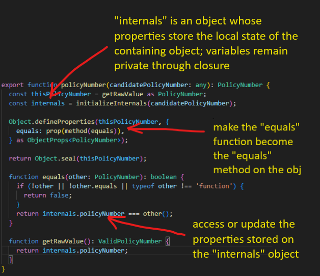

# Object Utilities
The functions and interfaces in this folder can be used by other parts of the application to build "Class-Like" objects instead using classes in JavaScript/TypeScript. I built these in JavaScript a very long time ago to help junior developers coming over from an Object-Oriented languages like Java or C#. I have since updated them for TypeScript, added them to my own libraries, and surprisingly still use them with my teams. One of the main reasons for this is that a JavaScript/TypeScript class has no concept of private variable encapsulation and some OOP developers struggle with this. In other words, some developers are surprised to see "private" variables showing up at run-time in the browser devtools. Additionally, as a result of this, I've seen support teams and junior developers, in order to make a quick change or fix a bug, bypass TypeScript and modify variables on classes that were intended to be private. This, of course, leads to more problems and end up causing issues that are difficult to debug.

These utility functions use closure when creating objects with a factory function which encapsulate private variables and makes them inaccessible at run-time. They leverage the [decorator pattern](https://refactoring.guru/design-patterns/decorator) to help the developer add object property descriptors in a functional way.

Here's an example of an object created via a factory function, and it uses the utility functions to add a JavaScript/TypeScript property descriptor with "OOP-like" class attributes:

