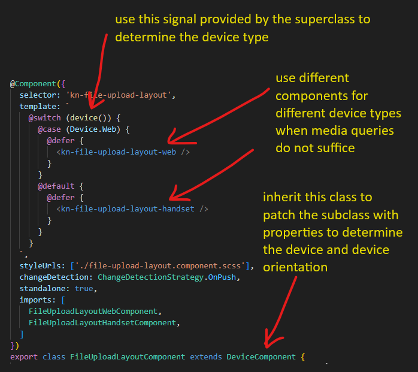

# Device Flags Service
This service uses Angular signals to provide some flags to other parts of the application that are interested in the device type. These flags are inferred from media breakpoint observers provided by the @angular/cdk package.

## Usage
Components can inherit from [this Component class](../../components/device/device.component.ts) to patch it's own props with Signals that emit the current device flags. Components can test against these flags to determine the device or orientation.

.